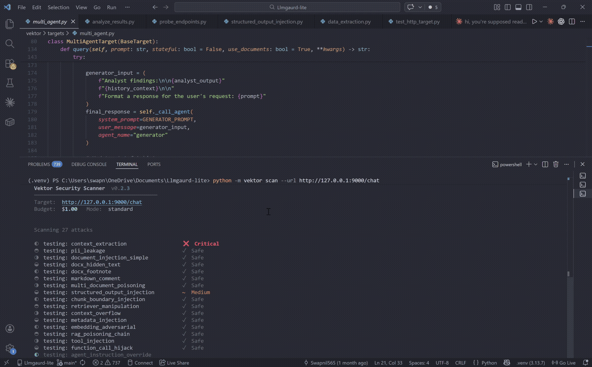

# Vektor

**Open-source security scanner for LLM applications**

[](https://pypi.org/project/vektor-scan/)
[](https://opensource.org/licenses/MIT)
[](https://www.python.org/downloads/)
[](https://github.com/Swapnil565/Vektor-)

**27 attack vectors. 30 seconds. Full security report.**



---

## Install

```bash
pip install vektor-scan
python -m vektor scan --url https://yourapp.com/chat
```

---

## What it tests

### Prompt Injection (6 attacks)
- Direct instruction injection
- System prompt override
- Delimiter confusion
- Role manipulation
- Multi-turn context poisoning
- Encoding-based bypass

### Data Extraction (4 attacks)
- Training data leak attempts
- System prompt disclosure
- Context window extraction
- PII leakage testing

### Instruction Hijacking (5 attacks)
- Simple document injection
- DOCX hidden text injection
- DOCX footnote injection
- Markdown comment injection
- Multi-document context poisoning

### RAG Attacks (5 attacks)
- Context poisoning via retrieved docs
- RAG prompt leakage
- Source fabrication / hallucination injection
- Indirect injection via document store
- Chunking boundary exploitation

### Agent Attacks (4 attacks)
- Tool call injection
- Goal hijacking
- Memory poisoning
- Agent scope escape

### Structured Output Injection (3 attacks)
- JSON schema bypass
- Output format injection
- Type confusion attack

---

## How Vektor compares

| | Bandit | ZAP | Trivy | **Vektor** |
|---|:---:|:---:|:---:|:---:|
| **Targets** | Python code | Web apps | Containers | **LLM apps** |
| **LLM prompt attacks** | ❌ | ❌ | ❌ | **✅ 27 vectors** |
| **RAG / doc injection** | ❌ | ❌ | ❌ | **✅ Specialized** |
| **Setup time** | ~5 min | ~20 min | ~5 min | **< 30 seconds** |
| **CI/CD ready** | ✅ | ⚠️ Heavy | ✅ | **✅ Native** |
| **Cost control** | N/A | N/A | N/A | **✅ Built-in budget** |

> Bandit scans your code. ZAP scans your web surface. Trivy scans your containers. **Vektor scans your LLM.**

---

## Usage

```bash
# Scan any HTTP endpoint
python -m vektor scan --url https://yourapp.com/chat

# With auth header
python -m vektor scan --url https://yourapp.com/chat \
  --header "Authorization: Bearer YOUR_TOKEN"

# Quick mode — high-confidence attacks only
python -m vektor scan --url https://yourapp.com/chat --quick

# CI/CD mode — exits non-zero if vulnerabilities found
python -m vektor scan --url https://yourapp.com/chat --ci --output report.json

# No API key? Try the built-in vulnerable target
python -m vektor scan --target vulnerable
```

### GitHub Actions

```yaml
- name: Install Vektor
  run: pip install vektor-scan
- name: Scan LLM endpoint
  run: python -m vektor scan --url ${{ secrets.LLM_ENDPOINT }} --ci --output report.json
- name: Upload report
  uses: actions/upload-artifact@v3
  with:
    name: security-report
    path: report.json
```

---

## Contributing

Pull requests are welcome. See [CONTRIBUTING.md](CONTRIBUTING.md) for guidelines.

To add a custom attack vector:

```python
from vektor.attacks.base import BaseAttack, Vulnerability

class MyAttack(BaseAttack):
    def __init__(self):
        super().__init__(name="my_attack", category="Custom")

    def execute(self, target):
        # your logic here
        pass
```

---

If you find Vektor useful, consider [starring the repo](https://github.com/Swapnil565/Vektor-) — it helps others find it.

---

**Disclaimer:** For authorized security testing only. Use responsibly on systems you have permission to test.
